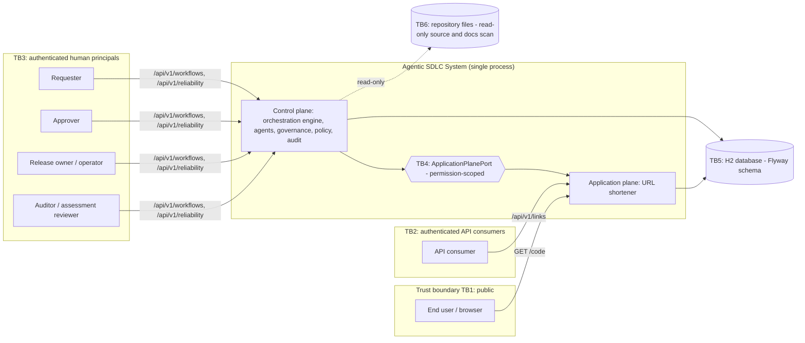
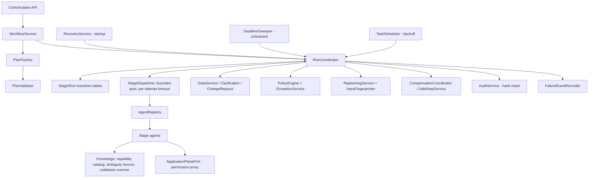
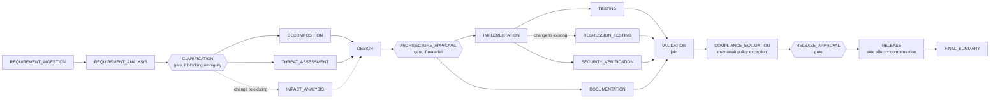

# Implementation Plan: Agentic Software Engineering System — URL Shortener

**Branch**: `001-agentic-url-shortener` | **Date**: 2026-09-26 | **Spec**: [spec.md](spec.md)

**Input**: Feature specification from `specs/001-agentic-url-shortener/spec.md` (clarified; G2/G3
pending ratification)

**Status**: Draft — pending Gate G4 (architecture approval). Technology choices other than the
candidate's directives (Spring Boot, Java 21) are proposals; each material decision has a
`Proposed` ADR in [`docs/adr/`](../../docs/adr/).

## Summary

Build one locally runnable Spring Boot 4.1 / Java 21 service with two planes:

- an **application plane**, a production-grade URL shortener (validated creation, unpredictable
  codes, public redirects with exact analytics, expiry, idempotency, rate limiting, health);
- a **control plane**, a governed agentic SDLC orchestration engine. It turns a submitted
  requirement into a released, verified capability of the shortener by executing a persisted,
  versioned dependency graph of 19 stage types.

The engine supports parallel fan-out and synchronization, conditional branches, human gates bound
to artifact fingerprints, bounded retry with fallback, compensation and safe-stop, resumption
after restarts, content-addressed replanning, a versioned policy engine with time-bound
exceptions, and a hash-chained audit trail. Reliability metrics, including MTTR, are computed from
persisted evidence. Agents are deterministic and knowledge-driven (Clarifications Q1). They verify
and release capabilities that were written through this repository's SpecKit process, and they
never generate code at runtime.

## Technical Context

**Language/Version**: Java 21 (candidate directive)

**Primary Dependencies**: Spring Boot 4.1.1 — `spring-boot-starter-webmvc`, `-data-jpa`, `-flyway`,
`-security`, `-validation`, `-actuator`; Micrometer with the Prometheus registry; Hibernate 7.4;
Jackson 3; SnakeYAML for the knowledge and policy resources

**Storage**: H2 2.4 as the runtime database (candidate directive; Maven `runtime` scope),
PostgreSQL mode: file database under `./data/` when the application runs, in-memory for tests;
Flyway 12 migrations `V1`–`V4`

**Testing**: JUnit Jupiter 6, AssertJ, Mockito, Spring Boot test starters (MockMvc), Awaitility,
ArchUnit 1.5.1, openapi-request-validator-core 3.0.0, JaCoCo 0.8.15

**Target Platform**: any OS with JDK 21 (developed and verified on Windows 11)

**Project Type**: web service — single deployable modular monolith

**Performance Goals**: demonstration targets PVT-19 (redirect p95 ≤ 50 ms), PVT-20 (creation
p95 ≤ 150 ms), PVT-21 (scenario processing ≤ 10 s excluding human wait); labeled as demonstration
measurements

**Constraints**: offline (no external services at runtime), no real secrets, single instance
(ASM-01), bounded agent concurrency, 2–3 day timebox

**Scale/Scope**: design point of 10 million links (NFR-SCA-02); tens of concurrent runs; 91
functional requirements, 26 NFRs, 9 success criteria, 3 scenarios, 7 drills

## Constitution Check (pre-design)

*GATE: must pass before Phase 0 research. Re-checked after Phase 1 design (see the end of this
document).*

| Principle | Result | Evidence |
|-----------|--------|----------|
| I Specification before implementation | PASS | Clarified spec with stable identifiers; implementation starts only after tasks and analysis (§14) |
| II Explicit agentic orchestration | PASS | Persisted DAG, parallel paths and joins, conditions, replanning, resume (§3) |
| III Human governance | PASS | Five gate types, role checks, separation of duties, fingerprint-bound approvals, deadlines → safe-stop (§5). G1–G3 are pending ratification under the recorded delegation, which the Governance clause permits |
| IV Test-driven engineering | PASS | Red-green-refactor per task group with an evidence log (§10) |
| V Security and privacy by design | PASS | Threat model and controls (§8); secure defaults; SBOM license policy |
| VI Compliance and change control | PASS | Versioned policy set, four outcomes, blocking, exceptions with expiry, change requests (§9) |
| VII Architecture and maintainability | PASS | Modular monolith with port-mediated plane boundary enforced by ArchUnit (§2, §3) |
| VIII Reliability and recovery | PASS | Failure taxonomy, bounded retries, fallback, rollback vs. compensation, safe-stop, resume (§6) |
| IX Observability and auditability | PASS | Run-scoped MDC, metrics, timeline, hash-chained audit, MTTR from evidence (§7) |
| X Traceability and integrity | PASS | Identifier chain plus an executable traceability check (§13); simulated faults labeled |
| XI Evidence-based completion | PASS | Definition of done enforced per task (tasks.md) and at convergence |

## Project Structure

### Documentation (this feature)

```text
specs/001-agentic-url-shortener/
├── spec.md              # clarified specification
├── plan.md              # this file
├── research.md          # Phase 0 decisions and evidence
├── data-model.md        # Phase 1 entities, migrations, state machines
├── quickstart.md        # Phase 1 run and validation guide
├── contracts/
│   ├── openapi.yaml     # HTTP API contract (v1.2.0)
│   ├── CHANGELOG.md     # versioning, compatibility, ownership rules
│   └── schemas/         # 13 JSON Schemas for stage artifacts
├── checklists/          # requirement-quality checklists (/speckit-checklist)
└── tasks.md             # /speckit-tasks output
docs/
├── adr/                 # Architecture Decision Records (Proposed until G4)
├── architecture/        # overview, orchestration model, security model
├── governance/          # human gate register, policy-set description
├── operations/          # runbook: run, drills, recovery
├── scenarios/           # SCN-A/B/C and drill evidence
├── traceability/        # requirement → test matrix (generated and checked)
└── assessment/          # analysis, reviews, TDD evidence, convergence, final summary, reviewer guide
```

### Source Code (repository root)

```text
pom.xml  mvnw  mvnw.cmd  .mvn/wrapper/
src/main/java/com/agentic/urlshortener/
├── UrlShortenerApplication.java
├── common/                       # shared infrastructure (no business rules)
│   ├── config/                   # Clock, filter registration and other cross-cutting beans
│   ├── exception/                # ErrorCode, ApiException, problem-detail handler
│   ├── security/                 # bearer-token filter, principals, roles, SecurityConfig
│   ├── util/                     # canonical JSON + SHA-256 fingerprints
│   └── web/                      # correlation-id filter
├── shortener/                    # APPLICATION PLANE (layered)
│   ├── controller/               # LinkController, RedirectController
│   ├── dto/                      # request/response records and service commands/views
│   ├── domain/                   # JPA entities (ShortLink, ClickEvent, IdempotencyRecord, ...), UrlPolicy, ShortCodeGenerator, AliasPolicy
│   ├── repository/               # Spring Data repositories and atomic update queries
│   ├── service/                  # LinkCreationService, RedirectService, LinkQueryService, ClickRecorder, IdempotencyService,
│   │                             # CapabilityService (release flags, preview scope), TokenBucketRateLimiter
│   └── config/                   # ShortenerProperties, rate-limiter beans, LinkStoreHealthIndicator
└── orchestration/                # CONTROL PLANE (layered, plus engine components)
    ├── controller/               # WorkflowController, GovernanceController, OperationsController, EvidenceController
    ├── dto/                      # request/response records and views
    ├── domain/                   # entities (WorkflowRun, StageNode, StageAttempt, Artifact, Decision, AuditEvent, ...) and enums
    ├── repository/               # Spring Data repositories
    ├── service/                  # WorkflowService and other application services
    ├── engine/                   # RunCoordinator, StageDispatcher, StageTransitions, RunTransitions, PlanValidator, ReadinessEvaluator
    ├── planning/                 # PlanFactory, ReplanningService, InputFingerprinter
    ├── governance/               # GateService, ClarificationService, ChangeRequestService, DeadlineSweeper
    ├── policy/                   # PolicySet (YAML), PolicyRule beans, PolicyEngine, PolicyExceptionService
    ├── reliability/              # FailureClassifier, RetryPolicy, CompensationCoordinator, SafeStopService, RecoveryService, FaultInjector, AutonomyBudget
    ├── audit/                    # AuditService (hash chain), AuditHashing, verification
    ├── metrics/                  # FailureEventRecorder, ReliabilityReportService, meters
    ├── agent/                    # StageAgent SPI, AgentRegistry, one agent per stage type, probes/
    ├── knowledge/                # CapabilityCatalog, AmbiguityLexicon, CodebaseScanner
    └── port/                     # ApplicationPlanePort (interface) + in-process adapter (integration/)
src/main/resources/
├── application.yml  application-demo.yml  application-json-logs.yml
├── db/migration/V1__shortener_baseline.sql … V4__click_limit.sql
├── orchestration/capability-catalog.yaml  ambiguity-lexicon.yaml  policy-set.yaml
└── scenarios/scn-a-greenfield.json  scn-b-brownfield.json  scn-c-ambiguous.json
src/test/java/com/agentic/urlshortener/   # mirrors main packages; plus architecture/, contract/, e2e/, traceability/
scripts/                          # demo helpers (PowerShell and bash)
```

**Structure Decision**: a single Maven module keeps setup trivial for reviewers; package-level
modules with ArchUnit-enforced rules give the separation Principle VII requires (research R-04,
ADR-001).

---

## 1. System Context



**Actors**: end user (follows links, anonymous); API consumer (manages links); requester
(submits requirements and change requests, requests exceptions); approver (clarifications,
architecture, change and exception decisions); release owner (release decision and run
operations: pause, resume, safe-stop); auditor (read-only evidence, for the assessment reviewer).

**External dependencies at runtime**: none beyond the local database file and a read-only view of
the repository tree, used by impact analysis and documentation checks with a fallback when absent.
No network calls, no AI services, no secrets.

**Trust boundaries**: TB1 public redirect endpoint (untrusted input: code path segment); TB2
bearer-authenticated consumers (untrusted URL input); TB3 bearer-authenticated humans (authorization
by role and separation of duties); TB4 control plane → application plane through a
permission-scoped port (agents hold only their declared permissions); TB5 database (the
application is the only writer; audit rows are insert-only); TB6 filesystem (read-only).

**Data ownership**

| Data | Owner | Writers | Readers |
|------|-------|---------|---------|
| `short_link`, `click_event`, `idempotency_record` | application plane | shortener services; synthetic rows through the port | consumers, probes |
| `capability_release` | application plane | **only** the `RELEASE` stage through the port | shortener services, auditors |
| run, stage, attempt, artifact, decision, plan, requirement, change request tables | control plane | engine and governance services | control-plane API |
| `policy_evaluation`, `policy_exception` | control plane (policy) | policy engine, exception service | compliance stage, auditors |
| `audit_event`, `failure_event` | control plane (evidence) | audit service (insert-only), failure recorder | auditors, reliability report |

**Plane responsibilities**: the application plane serves consumers and exposes capabilities
behind release flags; it knows nothing about workflows. The control plane owns requirement
processing, planning, governance, verification, release decisions, and evidence; it changes the
application plane only through the port.

## 2. URL Shortener Architecture

### Components

| Component | Responsibility | Requirements |
|-----------|----------------|--------------|
| `LinkController` | `POST /api/v1/links`, `GET /api/v1/links/{code}`, `.../stats`; maps domain errors to problem details | FR-LNK-01/11/13, FR-ANL-03 |
| `RedirectController` | `GET /{code:[A-Za-z0-9_-]{3,32}}` → 302 with `Cache-Control: no-store`, 404, 410, 429, 503 | FR-RED-01..05 |
| `UrlPolicy` | parse, validate (scheme allow-list, credentials, host, length, local and private addresses in all notations, self host), normalize | FR-LNK-02..04 |
| `ShortCodeGenerator` | `SecureRandom` base62 × 7; injectable for tests | FR-LNK-05/06 |
| `AliasPolicy` | alias syntax, length, reserved words | FR-CAP-02 |
| `LinkCreationService` | orchestrates validation, capability checks, expiry rules, idempotency, and the collision retry loop (≤ 5) around a transactional insert | FR-LNK-01/05/07/08/09/12, FR-CAP-01..04 |
| `IdempotencyService` | per-consumer key, request fingerprint, replay or `IDEMPOTENCY_KEY_REUSED` | FR-LNK-08/09 |
| `RedirectService` + `ClickRecorder` | resolve; atomic click increment and click event; fail-open (no rule) or fail-closed (click limit) | FR-RED-*, FR-ANL-01/04/05, FR-CAP-03 |
| `LinkQueryService` | metadata and 30-day daily aggregation | FR-LNK-11, FR-ANL-03 |
| `CapabilityService` | release flags (read), preview scope for synthetic verification, change through the port only | FR-CAP-01, R-15 |
| `TokenBucketRateLimiter` | creation per consumer, not-found per client address | FR-LNK-10, FR-RED-05 |
| `LinkStoreHealthIndicator` | readiness group member; timed query | FR-OPS-01 |
| `CorrelationIdFilter`, `ProblemDetailsHandler` | correlation id propagation (MDC and header); uniform RFC 9457 errors | FR-OPS-03/04 |
| `ShortenerProperties` | base URL, limits, reserved aliases, windows (all externalized) | configuration |

### Creation flow

```mermaid
sequenceDiagram
  participant C as API consumer
  participant LC as LinkController
  participant RL as RateLimiter
  participant S as LinkCreationService
  participant U as UrlPolicy
  participant CAP as CapabilityService
  participant DB as Database
  C->>LC: POST /api/v1/links (+Idempotency-Key)
  LC->>RL: tryConsume(consumer)
  RL-->>LC: ok | 429 RATE_LIMITED
  LC->>S: create(request, consumer, key)
  S->>U: validate + normalize(url)
  U-->>S: NormalizedUrl | URL_* error (400)
  S->>CAP: require(alias? custom-alias; maxClicks? click-limit) / default expiry parameter
  CAP-->>S: ok | 422 CAPABILITY_NOT_AVAILABLE
  loop at most 5 attempts (collision)
    S->>DB: TX: insert short_link (+ idempotency_record)
    DB-->>S: committed | unique violation (code → regenerate; alias → 409; key → replay)
  end
  S-->>LC: LinkResponse (201, Location)
```

### Redirect flow

`RedirectController` checks the not-found limiter for the client address, then calls
`RedirectService.resolve(code)`. The service loads the link: not found gives 404 (and consumes the
limiter); expired gives 410. With a click limit, the conditional atomic update decides between a
redirect and 410, and a store error returns 503 (fail closed). Without a limit, it runs the atomic
increment plus click-event insert, and on a store error it logs, increments
`shortener.analytics.failures`, and redirects anyway (fail open). The response is 302 with
`Location` and `Cache-Control: no-store`.

### API and schema deliverables

| Deliverable | Location | Version | Executable validation |
|-------------|----------|---------|-----------------------|
| HTTP API contract | `contracts/openapi.yaml` | 1.2.0 | `OpenApiContractTest` validates recorded MockMvc responses (status, headers, bodies) against the contract; `ContractDriftTest` compares controller mappings with contract paths both ways |
| Request, response, error, workflow-state, approval, audit-event, policy-evaluation schemas | `openapi.yaml#/components/schemas` | 1.2.0 | same tests |
| Stage-artifact schemas | `contracts/schemas/*.schema.json` | 1.0.0 each | `ArtifactSchemaTest` validates every agent output produced in the scenario tests |
| Persistence schema | `db/migration/V1`–`V4` | Flyway version | every Spring test context migrates from scratch; Hibernate `validate` |
| Compatibility and migration rules | `contracts/CHANGELOG.md`, `data-model.md` | — | policies `CHG-001` (approval) and `DOC-001` (docs) evaluated per run |
| Representative examples | `openapi.yaml` examples, `src/main/resources/scenarios/*.json` | — | scenario inputs are used by the end-to-end tests |

**Change impact records for the contract versions**

| Change | Owner | Version impact | Compatibility | Consumers | Tests | Docs | Rollout / migration | Approval |
|--------|-------|----------------|---------------|-----------|-------|------|---------------------|----------|
| 1.1.0 custom alias | application plane | MINOR | backward compatible (optional field, new codes) | API consumers | `AliasPolicyTest`, `LinkControllerAliasTest`, SCN-A probes | `docs/api/links.md`, changelog | `V3` additive; released by SCN-A run | architecture approval in the SCN-A run; G4 for the plan |
| 1.2.0 click limit | application plane | MINOR | backward compatible (optional field; 410 already documented for expiry) | API consumers | `ClickLimitRedirectTest`, concurrency test, SCN-B probes | same | `V4` additive, NULL = unlimited; released by SCN-B run; withdrawal keeps stored limits enforced | architecture approval in the SCN-B run |
| default expiry (behavior) | application plane | PATCH (documented behavior) | behavior-only: new links without `expiresAt` get one | API consumers | `DefaultExpiryTest`, SCN-C probes | same | parameter in `capability_release.parameters`; no migration | architecture approval in the SCN-C run |

## 3. Agentic Orchestration Architecture

### Components and control flow



`RunCoordinator.advance(runId)` is the single place where scheduling decisions are made. It runs
under a per-run lock (`ReentrantLock` keyed by run id; JPA optimistic locking as the safety net),
and every state change is persisted in a short transaction before any side effect is dispatched.
Agents run **outside** transactions and locks, on the bounded `stageExecutor` pool (default 8
threads). When an attempt finishes, its result is handed back to `onAttemptFinished`, which
re-acquires the lock, discards stale results (generation or attempt mismatch), persists outcome,
artifacts, and audit events, and calls `advance` again.

**Scheduling algorithm (advance)**

```text
advance(run):
  lock(run)
  if run is terminal or PAUSED or COMPENSATING: return
  loop until no change:
    for node in PENDING whose dependencies are all SUCCEEDED or SKIPPED:
      if condition(node) is false        -> SKIPPED(reason)                      [branch]
      else if entryCriteria(node) fail   -> FAILED(PERMANENT, reason)            [entry gate]
      else                               -> READY
    for node in READY:
      if node is a gate                  -> AWAITING_DECISION(deadline, review bundle fingerprints)
      else if inputFingerprint(node) == node.lastSuccessfulFingerprint
                                         -> SUCCEEDED(reused)                    [selective replanning]
      else if budget exhausted           -> safeStop(AUTONOMY_BUDGET_EXCEEDED)
      else                               -> RUNNING, dispatch(attempt)           [fan-out]
  derive run status: all terminal-successful -> COMPLETED (finalize);
                     nothing running/ready and a decision pending -> AWAITING_HUMAN
```

### Stage graph template



- **Sequential paths**: ingestion → analysis; design → approval → implementation;
  compliance → release approval → release → summary.
- **Parallel paths (fan-out)**: {decomposition ‖ threat assessment ‖ impact analysis};
  {implementation ‖ documentation}; {testing ‖ regression testing ‖ security verification}.
- **Synchronization (join)**: `DESIGN` waits for all analysis branches; `VALIDATION` waits for
  every verification branch and documentation.
- **Conditional branches**: `CLARIFICATION` is skipped with a recorded rationale when no blocking
  ambiguity exists. `IMPACT_ANALYSIS` and `REGRESSION_TESTING` are present only for
  `CHANGE_TO_EXISTING`. `ARCHITECTURE_APPROVAL` is skipped when the design declares no API, schema,
  or security-control change. `CHANGE_APPROVAL` is inserted only for material change requests
  after an approval.
- **Structural invariants** checked by `PlanValidator` before any execution: acyclic (Kahn), all
  dependencies resolvable, exactly one root (`REQUIREMENT_INGESTION`), `RELEASE` reachable only
  through `RELEASE_APPROVAL`, every side-effecting stage downstream of a gate.

### Stage specifications

Common to all agent stages: **allowed transitions** per the stage state machine in
[`data-model.md`](data-model.md#stage-status); **prohibited** transitions are rejected with an
`ILLEGAL_TRANSITION` audit event. Default retry policy: 3 attempts; backoff 200 ms × 2ⁿ, capped at
5 s; timeout 30 s (PVT-11/12). Failure classification is described in §6. Common audit events:
`STAGE_TRANSITION`, `ATTEMPT_STARTED`, `ATTEMPT_FINISHED`, `ATTEMPT_FAILED`, `RETRY_SCHEDULED`,
`ARTIFACT_RECORDED`.

| Stage (actor) | Purpose | Inputs → Outputs | Entry (preconditions) | Exit (postconditions) | Timeout / retry | Fallback | Side effects / compensation |
|---|---|---|---|---|---|---|---|
| `REQUIREMENT_INGESTION` (agent) | validate and fingerprint the requirement version | submission → `REQUIREMENT` | run started | document conforms to schema; fingerprint recorded | 5 s / 3 | none | none |
| `REQUIREMENT_ANALYSIS` (agent) | normalize, match capabilities, run the 5 quality checks, detect ambiguity | `REQUIREMENT` → `NORMALIZED_REQUIREMENT` (+ `CLARIFICATION_REQUEST` if blocking) | ingestion succeeded | every quality check has a result; classification set; plan refined if the classification changed | 10 s / 3 | none | none |
| `CLARIFICATION` (human gate, conditional) | resolve blocking ambiguity | `CLARIFICATION_REQUEST` → answer decisions → new requirement version | blocking ambiguity exists (else SKIPPED with rationale) | all blocking questions answered by an `APPROVER`; ≤ 3 rounds | deadline 24 h → safe-stop | — | none |
| `DECOMPOSITION` (agent) | dependency-aware engineering tasks | `NORMALIZED_REQUIREMENT` → `TASK_GRAPH` | no open blocking ambiguity | every acceptance criterion mapped to ≥ 1 task; task graph acyclic | 10 s / 3 | none | none |
| `THREAT_ASSESSMENT` (agent) | STRIDE threats with mitigations and verification probes | `NORMALIZED_REQUIREMENT` → `THREAT_MODEL` | as above | every HIGH threat names ≥ 1 verification probe | 10 s / 3 | none | none |
| `IMPACT_ANALYSIS` (agent, conditional) | brownfield impact from the live codebase | `NORMALIZED_REQUIREMENT` + source tree → `IMPACT_ANALYSIS` | classification `CHANGE_TO_EXISTING` | components, interfaces, data flows, tests, docs, risks, rollout/rollback all present | 20 s / 3 | **catalog-only analysis** (degraded) | none |
| `DESIGN` (agent, join) | components, API and schema delta, release and rollback plan, materiality | task graph + threat model (+ impact) → `DESIGN` | all branches succeeded | design valid; `materialChange` and reasons set | 10 s / 3 | none | none |
| `ARCHITECTURE_APPROVAL` (human gate, conditional) | approve a material design | review bundle: `DESIGN`, `THREAT_MODEL`, `IMPACT_ANALYSIS` | design material (else SKIPPED with reason) | `APPROVER` (≠ requester) approved; bound fingerprints recorded | deadline 24 h → safe-stop | — | none |
| `CHANGE_APPROVAL` (human gate, inserted) | approve or reject a material change request | change request + impact | material change after an approval | decided by an `APPROVER` (≠ requester) | deadline → safe-stop | — | none |
| `IMPLEMENTATION` (agent) | change set; verify the capability is delivered in the running system | `DESIGN`, `TASK_GRAPH` → `CHANGE_SET` | design approved or approval skipped | provider registered, migration applied, contract declares fields; else **permanent failure** | 10 s / 3 | none | none |
| `DOCUMENTATION` (agent) | generate API changelog, capability and runbook text; check repository docs | `DESIGN` → `DOCUMENTATION` | as implementation | generated docs present; repository docs check recorded | 10 s / 3 | **template docs** (degraded) | none |
| `TESTING` (agent) | execute acceptance probes in preview mode | `NORMALIZED_REQUIREMENT`, `CHANGE_SET` → `TEST_REPORT` | implementation succeeded | every acceptance criterion verified by ≥ 1 passing probe; synthetic data removed | 30 s / 3 | none (verification must not degrade) | creates synthetic links; removes them in `finally`; finalizer removes leftovers |
| `REGRESSION_TESTING` (agent, conditional) | baseline probes for existing behavior | `IMPACT_ANALYSIS` → `REGRESSION_REPORT` | implementation succeeded | all baseline probes pass | 30 s / 3 | none | as testing |
| `SECURITY_VERIFICATION` (agent) | malicious-URL catalog and threat verification probes | `THREAT_MODEL` → `SECURITY_REPORT` | implementation succeeded | all probes pass; every HIGH threat verified | 30 s / 3 | none | as testing |
| `VALIDATION` (agent, join) | consolidate verification branches | all reports → `VALIDATION_REPORT` | all predecessors succeeded | `passed = true` | 5 s / 3 | none | none |
| `COMPLIANCE_EVALUATION` (agent; can await an exception) | evaluate the pinned policy set; compute readiness | all artifacts + decisions → `COMPLIANCE_REPORT`, `READINESS_REPORT` | validation passed | no mandatory `FAIL` without an approved, unexpired exception | 10 s / 3 | none | none |
| `RELEASE_APPROVAL` (human gate) | release decision, including acceptance of limitations | `READINESS_REPORT`, `VALIDATION_REPORT`, `COMPLIANCE_REPORT` | compliance succeeded | `RELEASE_OWNER` (≠ requester) approved; readiness ≠ `NOT_READY` at decision time | deadline → safe-stop | — | none |
| `RELEASE` (agent) | release the capability, verify it after release | `DESIGN.releasePlan` → `RELEASE_RECORD` | release approved | capability released and post-release probe passed; otherwise rollback of release state, then permanent failure | 20 s / 3 | none | **rollback**: restore the previous flag state (idempotent) |
| `FINAL_SUMMARY` (agent) | final engineering summary | everything → `FINAL_SUMMARY` | release succeeded | summary recorded; for other terminal outcomes the finalizer produces it | 10 s / 3 | minimal summary | none |

### Agent contract and bounded autonomy

```java
public interface StageAgent {
    StageType stageType();
    String agentId();                         // e.g. "requirement-analyst@1.0"
    Set<AgentPermission> permissions();       // declared; enforced by the port proxy
    StageResult execute(StageContext context);
    default boolean hasSideEffects() { return false; }
    default CompensationOutcome compensate(StageContext context) { return CompensationOutcome.notRequired(); }
}
```

`StageResult` is one of `Succeeded(artifacts, notes)`, `Failed(classification, reason)`,
`NeedsClarification(questions)`, or `PolicyBlocked(evaluations)`. The `StageContext` gives
read-only access to the requirement version, input artifacts, the pinned policy set, a
cancellation signal, and a **permission-filtered** `ApplicationPlanePort`: `READ_LINKS`,
`WRITE_SYNTHETIC_LINKS`, `READ_CAPABILITIES`, `PREVIEW_CAPABILITY`, `CHANGE_CAPABILITY_RELEASE`
(release stage only). A call outside the declared permissions throws
`AgentPermissionDeniedException`: the attempt fails permanently and the event is audited
(NFR-AUT-01). Agents have no access to `GateService` or policy mutation (ArchUnit rule).

## 4. State and Decision Lineage

| Preserved item | Where | How it links |
|----------------|-------|--------------|
| Workflow instance state | `workflow_run`, `stage_node` | status, generation, attempts; optimistic version |
| Normalized requirements | `requirement_version` + `NORMALIZED_REQUIREMENT` artifacts | requirement version → artifact `input_refs` |
| Task decomposition and dependencies | `TASK_GRAPH` artifact; `plan_version.graph` | versioned per plan |
| Decisions, assumptions, approvals, rejections | `decision` | `bound_fingerprints` → artifacts; `supersedes` chains; `valid` flag |
| Artifact versions | `artifact` | `version` per type; `superseded`; `fingerprint`; `input_refs` |
| Test and risk outcomes | verification reports, `THREAT_MODEL`, `IMPACT_ANALYSIS`, `READINESS_REPORT` | inputs of compliance and readiness |
| Replanning history | `plan_version.diff`, `REPLAN` decisions, `STAGE_INVALIDATED` audit events | trigger decision id recorded |
| Correlation identifiers | run id (MDC `runId`), request `X-Correlation-Id` | present in logs, audit details, and problem details |
| Terminal status | `workflow_run.terminal_outcome`, `terminal_reason`; `RUN_TERMINATED` audit event | final summary artifact |

**Lineage query** (`GET .../artifacts/{id}`): walk `input_refs` transitively to collect the input
artifacts, then return every valid decision bound to any of them, plus the decisions that created
the requirement versions involved (clarification answers, change requests). The query answers
"which human decisions and which inputs produced this artifact".

## 5. Human-in-the-Loop Controls

| Control point | Trigger | Required role | Separation of duties | Deadline behavior | Approve | Reject |
|---------------|---------|---------------|----------------------|-------------------|---------|--------|
| Unresolved ambiguity (`CLARIFICATION`) | blocking ambiguity (analysis or any agent late) | `APPROVER` | — | safe-stop | new requirement version → replan | not applicable (answers can narrow scope, e.g. "out of scope") |
| Architecture approval | material design (API, schema, security control) | `APPROVER` | ≠ requester | safe-stop | dependents start; approval bound to fingerprints | compensation → `REJECTED` |
| Change control after approval (`CHANGE_APPROVAL`) | material change request | `APPROVER` | ≠ requester | safe-stop | amendment applied → replan | amendment discarded; run continues on the previous version |
| Policy exception | mandatory policy `FAIL` | request: `REQUESTER`; decide: `APPROVER` | decider ≠ exception requester | safe-stop | compliance re-evaluates → `EXCEPTION_REQUESTED` recorded | safe-stop |
| Release readiness and risk acceptance (`RELEASE_APPROVAL`) | compliance passed | `RELEASE_OWNER` | ≠ requester | safe-stop | release proceeds; accepted limitations recorded | compensation → `REJECTED` |
| Security-sensitive action | a design touching security controls is material → architecture approval | `APPROVER` | ≠ requester | as above | as above | as above |
| Destructive or irreversible action | none is automated: the port offers no operation on non-synthetic consumer data | — | — | — | — | — |
| Constitutional exception, final submission | repository level (gates G1–G7) | human candidate | — | — | — | — |

**Anti-bypass guarantees**: gate decisions exist only on HTTP endpoints that require a human
principal with the role; the engine never transitions a gate to `SUCCEEDED` without a valid
decision (enforced in the transition guard); agents cannot reach `GateService` (ArchUnit);
concurrent decisions are serialized by optimistic locking (one wins, the other gets
`409 CONCURRENT_DECISION`); lateness is refused (`409 DEADLINE_PASSED`); absence of a response
never approves.

## 6. Reliability

**Failure taxonomy**

| Failure | Classification | Handling |
|---------|----------------|----------|
| `TransientStageException`, `TransientDataAccessException`, lock acquisition failure | TRANSIENT | bounded retry with backoff |
| Attempt timeout | TRANSIENT | cancel (interrupt), discard any late result, retry |
| `PermanentStageException`, illegal argument, invalid output (exit gate) | PERMANENT | fallback if declared, else stage `FAILED` → safe-stop |
| `AgentPermissionDeniedException` | PERMANENT | stage `FAILED`, security audit event → safe-stop |
| Capability not delivered (implementation check) | PERMANENT | safe-stop (no fabrication) |
| Post-release verification failure | PERMANENT | rollback of release state inside the stage → safe-stop |
| Process interruption | TRANSIENT (cause `PROCESS_INTERRUPTION`) | recovery on startup re-dispatches (counts toward attempts) |
| Compensation failure | — | compensation retried 3 times, then `SAFE_STOPPED` with `manualInterventionRequired` |
| Gate deadline passed, autonomy budget exceeded, clarification rounds exceeded | governance stop | safe-stop |
| Policy block, human rejection | governance outcomes, **not failures** | exception decision / `REJECTED` |

**Retry and timeout**: per-stage `maxAttempts`, `timeout`, `backoff` in `application.yml`
(`app.orchestration.stages.*`), defaults from PVT-11/12; tests shorten them. Backoff is scheduled
on the `TaskScheduler` (`RETRY_WAIT` with a persisted `next_attempt_at`).

**Idempotency and duplicate protection**: each attempt carries `(generation, attemptNo)`; results
for any other pair are discarded as `DISCARDED`. Capability release is a *set* (not a toggle)
operation. Synthetic cleanup deletes by `synthetic_run_id`. Recovery re-dispatches only stages
whose attempt has no `finished_at`.

**Rollback versus compensation**

| Side effect | Mechanism | Why |
|-------------|-----------|-----|
| Capability release flag | **Rollback** (restore the previous state) | fully under system control; stored per-link behavior is unaffected (Q4) |
| Synthetic probe data | **Compensation** (delete the rows the run created) | the rows were visible in the live store while they existed |
| Exposure of a released capability to consumers | **Compensation** (withdraw for new use; record the exposure window) | links already created cannot be un-shared |
| Audit events | none: append-only, never rolled back | evidence integrity |
| Human decisions | superseded, never deleted | lineage |

**Safe-stop procedure**: (1) mark the run as stopping, so no new dispatch happens; (2) cancel
in-flight attempts cooperatively and discard their late results; (3) run compensation in reverse
completion order for stages with side effects; (4) remove leftover synthetic data; (5) persist the
terminal outcome and reason; (6) produce the final summary; (7) emit `RUN_TERMINATED`.

**Resumption**: on `ApplicationReadyEvent`, `RecoveryService` scans non-terminal runs. Attempts
without `finished_at` become `INTERRUPTED`, which opens a failure event with cause
`PROCESS_INTERRUPTION`, and their stage is re-dispatched. `RETRY_WAIT` stages are rescheduled;
`COMPENSATING` runs resume compensation; waiting gates keep their deadlines. `PAUSED` runs stay
paused until an operator resumes them.

**Partial failure**: when one parallel branch fails permanently, the run begins safe-stop and
running siblings are cancelled. **Dependency unavailability**: if the database is unavailable,
engine transactions fail; no state is lost because every transition is persisted before its side
effect. The run resumes from the last persisted state when the store returns (recovery on
restart).

**Autonomy budget**: 60 stage attempts and 10 minutes of processing time per run (PVT-17),
checked before each dispatch.

## 7. Observability

- **Logs**: MDC `runId`, `stage`, `attempt`, `correlationId`; `Authorization` headers and tokens are
  never logged; structured ECS JSON in the `json-logs` profile.
- **Metrics** (Micrometer → `/actuator/prometheus`): `shortener.links.created`,
  `shortener.redirects{outcome}`, `shortener.analytics.failures`,
  `shortener.ratelimit.rejected{limiter}`, `sdlc.runs.started`, `sdlc.runs.terminated{outcome}`,
  `sdlc.stage.attempts{stage,outcome}`, `sdlc.stage.retries{stage}`, `sdlc.stage.fallbacks{stage}`,
  `sdlc.compensations{result}`, `sdlc.stage.duration{stage}` (timer), `sdlc.gates.waiting` (gauge).
- **Traces**: a Micrometer `Observation` named `sdlc.stage` wraps each attempt (with runId and stage
  tags), so a tracing bridge can be added later without code changes. The persisted timeline
  (`GET .../timeline`) is the reviewer-facing trace.
- **Audit and history**: state transitions, decisions, approvals, retries, compensations,
  replanning, and policy evaluations are recorded as hash-chained audit events (catalog in
  `data-model.md`).

**Reliability metrics** (`ReliabilityReportService`, computed from the database)

| Metric | Definition |
|--------|------------|
| Success rate | `COMPLETED` runs ÷ terminal runs |
| Failure rate | `SAFE_STOPPED` runs ÷ terminal runs (`REJECTED` reported separately as a governance outcome) |
| Retry frequency | retry attempts ÷ all attempts |
| Rollback / compensation frequency | runs with ≥ 1 compensation or rollback ÷ terminal runs |
| MTTR | Σ(recovery_completed_at − detected_at) over **recovered** failure events ÷ number of recovered failure events |
| Individual recovery duration | recovery_completed_at − detected_at per event, listed |
| Unrecovered failures | count and list of failure events with status `UNRECOVERED`; excluded from the MTTR denominator |
| End-to-end latency | per completed run: (completed_at − started_at) − time spent waiting for human decisions; min, p50, p95, max |

**MTTR capture**: `detected_at` is the end of the first failed attempt of a stage generation (for
timeouts, the timeout instant; for interruptions, the recovery scan time). `recovery_started_at`
is the start of the next attempt (retry, fallback, or resume). `recovery_completed_at` is the end
of the successful attempt; `mechanism` is `RETRY`, `FALLBACK`, or `RESUME`. **Population**: all
failure events at report time. **Exclusions** (reported with counts): `OPEN` events of active
runs, and events whose stage generation was invalidated by replanning before recovery.
**Limitations**: synthetic workloads and injected faults, single machine; figures are labeled
`DEMONSTRATION DATA - not production statistics`.

## 8. Security

**Threat model (STRIDE)**

| # | Threat | Category | Mitigation | Verification |
|---|--------|----------|------------|--------------|
| T1 | Short links used to redirect to phishing or malware sites | Spoofing | authenticated creation with accountability (Q2), scheme allow-list, rate limits; reputation scanning deferred (EXC-06, residual risk) | `UrlPolicyTest`, rate-limit tests |
| T2 | Redirects to internal targets (`localhost`, private, link-local, metadata IPs, obfuscated IP notations) | Elevation of privilege | `UrlPolicy` rejects local names and private ranges in all notations | security URL catalog (≥ 25 cases, PVT-15) |
| T3 | `javascript:`, `data:`, `file:` scheme injection | Tampering | allow-list `http`/`https` | catalog |
| T4 | Code enumeration | Information disclosure | 62⁷ random codes; not-found throttling | `ShortCodeGeneratorTest`, throttling test |
| T5 | Redirect loop through the shortener's own host | Denial of service | self-host rejection | catalog |
| T6 | Approval bypass or self-approval | Elevation of privilege | role checks, separation of duties, transition guard, ArchUnit rule | governance tests |
| T7 | Agent exceeding its mandate | Elevation of privilege | declared permissions, permission-filtered port | agent permission tests |
| T8 | Audit tampering | Repudiation | hash chain plus verification; insert-only | tamper tests |
| T9 | Secret leakage in logs or artifacts | Information disclosure | tokens stored as SHA-256; no header logging; policy `SEC-002` scans artifacts | log capture test, policy test |
| T10 | Resource exhaustion (runs, redirects) | Denial of service | bounded worker pool, autonomy budget, rate limits, request size limits | budget and limit tests |
| T11 | Vulnerable or non-approved dependencies | Tampering | SBOM plus license policy `LIC-001`; vulnerability scanning in CI (BL-03) | `LIC-001` evaluation |
| T12 | Fault-injection or preview mode abused in production | Elevation of privilege | disabled by default; preview is in-process only (no HTTP path) | configuration and security tests |
| T13 | SQL injection | Tampering | parameterized JPA/JDBC queries only | code review, tests with hostile input |

**Release-readiness security checks (repository level, constitution V)**: before the release
decision, (1) an executable **repository secret scan** checks every tracked text file for
private keys, cloud credentials, bearer tokens, and `password=` values, allow-listing only the
labeled demo tokens and their hashes; (2) a **dependency vulnerability scan** runs OSV-Scanner (a
pinned release) against the CycloneDX SBOM and records findings with dispositions. If the scanner
cannot run, the gap is recorded as a release limitation that needs the candidate's explicit
exception at G6. Results are stored in `docs/assessment/security-scans.md`.

**Authentication assumptions**: bearer tokens stand in for an enterprise identity provider
(ASM-02). Tokens are compared by SHA-256 hash in constant time. Missing or invalid credentials
return `401` with no detail about which part failed. **Rate limiting**: §2. **Secrets management**:
no real secrets exist; demo token hashes live only in `application-demo.yml` and are labeled; the
production path is environment or secret-store injection. **Least privilege**: roles per endpoint
(§5), agent permissions (§3), audit insert-only. **Secure defaults**: default profile without
principals, fault injection off, H2 console excluded, Actuator exposes only `health` and `info`
publicly.

## 9. Compliance and Change Control

**Policy set `1.0.0`** (`orchestration/policy-set.yaml`; evaluated by `COMPLIANCE_EVALUATION`, with
the version pinned per run)

| Policy | Domain | Severity | Applies when | Evaluation input → PASS condition |
|--------|--------|----------|--------------|-----------------------------------|
| SEC-001 | SECURITY | MANDATORY | always | `SECURITY_REPORT`: all URL-validation probes passed |
| SEC-002 | SECURITY | MANDATORY | always | all run artifacts: no secret patterns (private keys, bearer tokens, `password=` values) |
| SEC-003 | SECURITY | MANDATORY | threats present | every HIGH threat in `THREAT_MODEL` verified by a passing probe |
| PRV-001 | PRIVACY | MANDATORY | schema changes | no schema change adds personal-data columns (IP, e-mail, user agent, name) |
| AUD-001 | COMPLIANCE | MANDATORY | always | the run's audit chain verifies |
| AUD-002 | COMPLIANCE | MANDATORY | always | configured audit retention ≥ 365 days |
| LIC-001 | LICENSING | MANDATORY | always | every SBOM component license is on the allow-list (Apache-2.0, MIT, BSD-2/3-Clause, EPL-1.0/2.0, EDL-1.0, MPL-2.0, LGPL-2.1 dual-licensed, CDDL, Public Domain); SBOM missing → FAIL |
| TST-001 | TESTING | MANDATORY | always | every acceptance criterion verified by ≥ 1 passing probe |
| TST-002 | TESTING | MANDATORY | change to existing behavior | regression suite passed |
| DOC-001 | DOCUMENTATION | MANDATORY | API or behavior change | generated documentation present and repository docs mention the capability |
| CHG-001 | CHANGE_CONTROL | MANDATORY | material change | a valid architecture approval bound to the current design fingerprint |
| CHG-002 | CHANGE_CONTROL | MANDATORY | change to existing behavior | impact analysis present and **not degraded** |
| REL-001 | RELEASE | MANDATORY | always | the design contains a rollback plan and a release plan |
| AUT-001 | COMPLIANCE | ADVISORY | always | autonomy budget usage < 80% |

**Outcomes**: `PASS`; `FAIL`; `NOT_APPLICABLE` (condition false, with evidence stating why);
`EXCEPTION_REQUESTED` (a failed policy covered by an approved, unexpired exception: the outcome
records the exception id). **Mandatory `FAIL`** puts `COMPLIANCE_EVALUATION` into
`AWAITING_DECISION(POLICY_EXCEPTION)`: downstream is blocked. **Advisory `FAIL`** is recorded and
turns readiness into `READY_WITH_ACCEPTED_LIMITATIONS`.

**Exception workflow**: the requester files `{policyId, reason, scope, compensatingControl,
expiresAt}` (status `PENDING`). An approver other than that requester approves or rejects. On
approval the compliance stage re-executes and records `EXCEPTION_REQUESTED`, with the exception
listed as an accepted limitation. On rejection, or when the deadline passes, the run safe-stops.
Expiry is re-checked when readiness is computed and again at the release decision.

**Change-request workflow**: submit an amendment → impact analysis (downstream closure, approvals
whose bound artifacts would change, and materiality: API, schema, security, or release-criteria
change) → apply immediately if not material or if no approval exists yet; otherwise insert
`CHANGE_APPROVAL` as a new dependency of every not-yet-started stage (plan version N+1). Approve →
amendment applied (requirement version + 1, invalidation, plan version N+2). Reject → gate
removed, run continues (plan version N+2).

**Release-blocking conditions** (readiness `NOT_READY`): validation not passed; a mandatory policy
`FAIL` without an approved, unexpired exception; a pending change request; an invalidated approval
not yet re-granted.

**Upstream change → downstream revalidation**: every replanning bumps the generation of the
affected stages, so policies are re-evaluated on the new generation. Evaluations and approvals of
superseded generations remain in history but no longer count.

**Repository-level change control** (the SpecKit process): gates G1–G7, ADR status, contract
changelog versioning, and `/speckit-analyze` after any upstream edit.

## 10. Testing Strategy

| Test type | Scope | Tools | Package | Key requirements |
|-----------|-------|-------|---------|------------------|
| Domain unit | URL policy, code generator, alias policy, expiry, token bucket | JUnit, AssertJ | `shortener.domain`, `shortener.ratelimit` | FR-LNK-*, FR-RED-05 |
| API contract | response conformance, drift | MockMvc + openapi-request-validator | `contract` | all endpoints |
| Persistence | migrations, atomic updates, unique constraints | `@DataJpaTest` + Flyway | `shortener.persistence` | FR-LNK-05/09, FR-ANL-05 |
| Integration | controllers, security, error mapping, idempotency, rate limits | `@SpringBootTest` + MockMvc | `shortener.api`, `platform` | US1 |
| Orchestration transitions | state tables (allowed and prohibited), plan validation | JUnit | `orchestration.engine` | FR-ORC-02/11 |
| Engine behavior | parallel, join, conditions, reuse, budget | scripted agents + Awaitility | `orchestration.engine` | FR-ORC-04..08 |
| Approval and rejection | roles, SoD, binding, deadlines, concurrency | `@SpringBootTest` | `orchestration.governance` | FR-GOV-* |
| Retry, timeout, fallback | bounded attempts, late-result discard, degraded marking | scripted agents | `orchestration.reliability` | FR-REL-01..03, 09 |
| Compensation, safe-stop | reverse order, failure → manual flag | scripted agents | same | FR-REL-04..06, 10 |
| Resumption | restart with a file database (second application context) | `SpringApplicationBuilder` | same | FR-REL-08, SC-007 |
| Replanning | invalidation, reuse by fingerprint, approval invalidation, change control, late ambiguity | scripted agents | `orchestration.planning` | FR-RPL-* |
| Concurrency | 200 concurrent redirects, concurrent idempotent creates, concurrent decisions | executor + latch | several | FR-ANL-05, FR-LNK-09 |
| Security | URL catalog, authN/authZ matrix, secret-in-log check, fault injection disabled | MockMvc | `security` | NFR-SEC-* |
| Repository security scans | secret patterns in tracked files; SBOM vulnerability scan (OSV-Scanner) | JUnit file scan; OSV-Scanner CLI | `security`; `docs/assessment/security-scans.md` | NFR-SEC-03, NFR-SEC-05, constitution V |
| Governance invariants | across every end-to-end run: no stage downstream of an undecided gate started; no release after an unexcepted mandatory `FAIL`; no gate succeeded without a valid decision | audit-trail analysis | `e2e` | SC-004, FR-GOV-02/03, FR-POL-03 |
| Architecture | plane boundaries, agent restrictions, layering | ArchUnit | `architecture` | NFR-MNT-01, NFR-AUT-01 |
| Agents | each agent's output against its JSON Schema | JUnit + schema validation | `orchestration.agent` | FR-ORC-13..16 |
| End-to-end | SCN-A/B/C and RDR-01..07 over HTTP, with evidence export | `@SpringBootTest(RANDOM_PORT)` | `e2e` | SC-002 |
| Release readiness | readiness outcomes, exception expiry | JUnit | `orchestration.policy` | FR-RDY-* |
| Traceability | every FR and SCN id tagged by ≥ 1 test | source scan of `@Tag` | `traceability` | SC-003 |

**TDD**: each task group follows red → green → refactor. The failing run (expected failure reason)
and the passing run are recorded in `docs/assessment/tdd-evidence.md` with the command used.
**Determinism**: injectable `Clock` and code generator; Awaitility with explicit timeouts; no
reliance on test order; each Spring test context uses its own in-memory database.

## 11. Scenario Designs

### SCN-A — greenfield (custom alias)

- **Initial input**: `scenarios/scn-a-greenfield.json` (GF-001, spec text).
- **Interpretation**: capability `custom-alias` matched by the terms "alias" and "custom";
  classification `NEW_CAPABILITY` (declared and consistent); all 5 quality checks `PASS`; 0
  ambiguities → `clarificationRequired = false`, with the rationale recorded.
- **Decomposition**: WT-01 contract field and codes; WT-02 migration V3; WT-03 alias policy; WT-04
  creation path (depends on WT-02 and WT-03); WT-05 probes per acceptance criterion; WT-06 docs;
  WT-07 release plan.
- **Orchestration path**: ingestion → analysis → [decomposition ‖ threat] → design (API 1.1.0,
  V3; material) → architecture approval → [implementation ‖ documentation] → [testing ‖ security]
  → validation → compliance → release approval → release → summary. `CLARIFICATION` is skipped.
- **Approvals**: architecture (`bob`), release (`carol`), in the automated test as simulated human
  input.
- **Failure paths**: the variant run with `TRANSIENT_ERROR ×2` on `TESTING` recovers by retry
  (MTTR sample).
- **Validation**: probes CA-P1..P6 map to AC-1..AC-6; security probes include reserved-word and
  route-collision aliases.
- **Evidence**: E-A1..E-A9 exported to `target/evidence/scn-a/`.
- **Expected terminal outcome**: `COMPLETED`, `READY`, `custom-alias` released.

### SCN-B — brownfield (click limit)

- **Initial input**: `scenarios/scn-b-brownfield.json` (BF-001).
- **Interpretation**: capability `click-limit`; classification `CHANGE_TO_EXISTING`; impacted
  existing requirements FR-ANL-04 (fail-open conflict, resolved by AC-6), FR-RED-04, and FR-LNK-11.
- **Decomposition**: contract field; migration V4; conditional atomic update; fail-closed branch;
  concurrency test; regression probes; docs; release plan.
- **Orchestration path**: adds `IMPACT_ANALYSIS` in parallel with decomposition and threat
  assessment, and `REGRESSION_TESTING` in parallel with testing and security verification.
- **Impact analysis**: a source scan seeded from the catalog components (`RedirectService`,
  `ClickRecorder`, `ShortLink`, `LinkCreationService`, the repositories) builds the
  reverse-dependency closure. The tests importing impacted classes and the docs mentioning the
  redirect or stats endpoints are listed as impacted. Regression risks: redirect latency, lost
  updates, and fail-open/fail-closed divergence. Rollout: flag release. Rollback: flag withdrawal;
  additive V4; stored limits keep being enforced.
- **Repository process**: this impact analysis is executed against the codebase **before** the
  click-limit code is written (guide section 19 gate) and committed as evidence; implementation
  then follows TDD.
- **Expected terminal outcome**: `COMPLETED`, `READY`; pre-existing links stay unlimited
  (regression probe R-P4).

### SCN-C — ambiguous (link expiry)

- **Initial input**: `scenarios/scn-c-ambiguous.json` (AMB-001, no acceptance criteria).
- **Interpretation**: ambiguities: VAGUE_TERM "after a while" (HIGH), UNDEFINED_CONCEPT "premium
  users" (HIGH), CONFLICT expire vs. never expire (HIGH), UNBOUNDED_SCOPE "make the analytics
  better" (MEDIUM, blocking), MISSING_ACCEPTANCE_CRITERIA (HIGH), UNSPECIFIED_TYPE (LOW).
- **Orchestration path**: plan v1 (template for an undetermined type) → analysis → `CLARIFICATION`
  awaiting an `APPROVER`. Downstream stages stay `PENDING`, so no decomposition, design, or
  implementation starts. After the answers: requirement v2 (generated acceptance criteria from the
  decisions, exclusions for tiers and analytics) → analysis generation 2 → classification
  `CHANGE_TO_EXISTING` → plan v2 adds `IMPACT_ANALYSIS` and `REGRESSION_TESTING` (recorded diff) →
  brownfield path → release with `{"defaultExpiryDays": <decided value>}`.
- **Approvals**: clarification, architecture, release; simulated in automated tests (labeled);
  the live walkthrough uses the reviewer's own answers.
- **Failure paths**: a second-round ambiguity, if introduced by answers, opens round 2; more than
  3 rounds → safe-stop (tested).
- **Evidence**: the 17 items of the spec's SCN-C evidence list, exported to `target/evidence/scn-c/`.
- **Expected terminal outcome**: `COMPLETED`, `READY`, `default-expiry` released with the decided
  parameter.

## 12. Technology Decisions

| Decision | Options | Criteria | Selected | Rationale | Risks | Reversibility | Validation | ADR |
|----------|---------|----------|----------|-----------|-------|---------------|------------|-----|
| Application architecture | monolith modules / services / multi-module | simplicity, boundary enforcement, demonstrability | modular monolith | boundaries without network failure modes | package drift | medium | ArchUnit | ADR-001 |
| Language and framework | Boot 4.1 / 4.0 / 3.5 on Java 21 | support window, candidate directive | Boot 4.1.1, Java 21 | longest OSS support; directive | Boot 4 API changes | medium | build + tests | ADR-002 |
| Persistence | H2 + Flyway / PostgreSQL / in-memory | zero-install, durability, portability, candidate directive | H2 runtime database (PG mode, file) + Flyway — **candidate directive** | runs anywhere, survives restarts | not a production DB | high (JPA + Flyway) | migration tests | ADR-003 |
| Short codes | random base62 / sequence / hash | unpredictability, collision math | random base62 × 7 + unique index | non-enumerable; negligible collisions | none material | high | generator and collision tests | ADR-004 |
| Orchestration model | custom engine / Temporal / Camunda / State Machine / LangGraph4j | governance fidelity, infrastructure, testability | custom persisted DAG engine | governance semantics are the product | engine bugs | low (core asset) | orchestration suites | ADR-005 |
| State persistence and concurrency | relational + locks / event sourcing / in-memory | recoverability, simplicity | relational rows + per-run lock + optimistic versions | resumable, inspectable | single instance | medium | restart tests | ADR-006 |
| Graph representation | adjacency lists + versioned snapshots / BPMN / code-defined | explicitness, diffing | adjacency + JSON snapshots | diffable plan versions | — | high | plan tests | ADR-007 |
| Human approval model | bearer roles + SoD + fingerprint binding / plain flags | non-bypassability, binding | roles + SoD + binding + deadlines | approvals mean what was reviewed | token management | medium | governance tests | ADR-008 |
| Retry, fallback, safe-stop | per-stage policies / global / none | boundedness, clarity | per-stage bounded policy + registry | explicit and configurable | tuning | high | reliability suites | ADR-009 |
| Rollback vs compensation | flags + synthetic cleanup / destructive rollback | consumer safety | flag rollback; compensation for data | never touches consumer data | exposure window | — | RDR-03 | ADR-010 |
| Replanning | fingerprint reuse / full restart / closure re-run | selectivity, governance | content-addressed re-execution | re-executes only changed work | fingerprint canonicalization | medium | replanning suite | ADR-011 |
| Observability and audit | hash chain + DB report / logs only | tamper evidence, reproducibility | hash chain + computed report | verifiable and restart-proof | chain rewrite by DB admin | medium | tamper tests | ADR-012 |
| Testing strategy | pyramid + contract + E2E / E2E only | speed, confidence | layered suite + executable traceability | fast feedback, full coverage map | suite runtime | high | CI run | ADR-013 |
| Deployment and local execution | jar + wrapper / Docker | reviewer setup time | jar + wrapper, profiles | fewer prerequisites | no container | high | quickstart run | ADR-014 |
| AuthN/AuthZ | hashed bearer tokens / Basic / OAuth2 | least privilege, setup | hashed bearer tokens with roles | no IdP needed; roles map to production | static tokens | high | authorization matrix tests | ADR-015 |
| Analytics consistency | sync exact / async / cached | accuracy, click-limit needs | synchronous exact (Q5) | click limits need exactness | write per redirect | medium | concurrency tests | ADR-016 |
| Runtime agents | deterministic / LLM + fallback / LLM codegen | reproducibility, secrets, scope | deterministic + SPI (Q1) | offline, testable | limited reasoning depth | high (SPI) | agent tests | ADR-017 |
| Capability release | DB flags via port / config / deploys | runtime governance, audit | DB flags + preview scope (Q4) | real, reversible release | flag sprawl | high | RDR-03, scenarios | ADR-018 |
| Policy engine | YAML + Java rules / OPA / hard-coded | versioning, evidence | YAML set + rule beans | versioned, simple | rule coverage | high | policy tests | ADR-019 |

## 13. Traceability

Chain: **Requirement** (`FR-*`, `NFR-*` in spec.md) → **Scenario** (`SCN-*`, `RDR-*`) →
**Design** (this plan's sections; data model; contracts) → **ADR** (`ADR-0NN`) → **Task**
(`T###` in tasks.md, each citing requirement, scenario, and ADR ids) → **Code** (package or class
per task) → **Test** (JUnit `@Tag("FR-...")`, `@Tag("SCN-A")`) → **Validation** (Surefire reports,
`target/evidence/`) → **Documentation** (docs pages citing ids) → **Evidence**
(`docs/scenarios/`, `docs/assessment/`).

`TraceabilityMatrixTest` parses `spec.md` for every FR/NFR/SCN/RDR identifier, scans the test
sources for `@Tag` values, writes `target/traceability/requirements-to-tests.md`, and **fails** on
an orphan requirement (an FR or SCN without a test), an orphan test (a test class without any
requirement, scenario, or drill tag), or an orphan task (a task in `tasks.md` without a `Req`
field). Orphan implementation is prevented by task scope: every task names the paths it creates,
and the convergence review compares changed paths with task paths. The committed matrix
`docs/traceability/requirements-to-tests.md` is refreshed from this output at convergence.

## 14. Delivery Sequence and Scope Control

| Milestone | Vertical slice | Exit criterion | Timebox |
|-----------|----------------|----------------|---------|
| M0 | Engineering baseline: POM, wrapper, enforcer, profiles, Flyway V1/V2, ArchUnit skeleton, `CLAUDE.md` | `mvnw verify` green on an empty test suite | Day 1 |
| M1 | Walking skeleton: security filter, correlation id, problem details, health, `POST /links` minimal, contract-test spike | contract test validates one response | Day 1 |
| M2 | Core URL behavior: validation, codes, redirect, expiry, analytics, idempotency, rate limits, store unavailable | US1 acceptance tests green | Day 1 |
| **CP1** | Scope checkpoint | if M2 is incomplete, drop not-found throttling sophistication and keep a simple limiter | — |
| M3 | Orchestration state model: entities, transitions, plan factory and validator, coordinator, dispatcher, audit chain | parallel/join/condition tests green with scripted agents | Day 2 |
| M4 | Approval governance: gates, roles, SoD, binding, deadlines, clarification API | governance suite green | Day 2 |
| M5 | Reliability controls: retry, timeout, fallback, compensation, safe-stop, pause/resume, recovery, budget, fault injection | reliability suite and restart test green | Day 2 |
| **CP2** | Scope checkpoint | if M5 slips, defer late-ambiguity path suspension to a single engine-level test | — |
| M6 | Policy and replanning: policy set, exceptions, readiness, fingerprint reuse, change requests | policy and replanning suites green | Day 2–3 |
| M7 | Agents and knowledge; capabilities custom-alias (V3), **brownfield impact gate**, click-limit (V4), default-expiry | agent schema tests green; SCN-B impact evidence committed before the V4 code | Day 3 |
| **CP3** | Scope checkpoint | if M7 slips, the documentation agent keeps the template path only | — |
| M8 | Observability and evidence: metrics, reliability report, timeline, summary, E2E scenarios and drills | SC-002 10/10 | Day 3 |
| M9 | Release readiness: traceability test, docs, converge, final summary, reviewer guide | converge report; release decision proposal | Day 3 |

**Critical path**: M0 → M1 → M2 → M3 → M4 → M5 → M6 → M7 → M8 → M9. With more people, M2 and
M3–M5 could run in parallel. This execution has a single implementer.

**Execution order in `tasks.md`**: SpecKit organizes tasks by user story, so the milestones above
(ordered by technical layer) are delivered in story order. The milestone content maps to task
phases as follows:

| Task phase | Milestone content delivered |
|------------|-----------------------------|
| Phase 1–2 Setup, Foundational | M0, M1 |
| Phase 3 US1 | M2, then CP1 |
| Phase 4 US2 (SCN-A) | M3 (state model, engine), the policy-evaluation core of M6, the agents and custom-alias capability of M7, SCN-A of M8 |
| Phase 5 US3 | M4 |
| Phase 6 US4 | M5, the exception and readiness parts of M6, the drills of M8, then CP2 |
| Phase 7 US5 (SCN-B) | the brownfield gate and click-limit capability of M7, SCN-B of M8 |
| Phase 8 US6 (SCN-C) | the replanning part of M6, the default-expiry capability of M7, SCN-C of M8, then CP3 |
| Phase 9 US7 | the evidence, MTTR, and traceability parts of M8 |
| Phase 10 Polish | M9 |

**Stop conditions**: a failing mandatory test that cannot be fixed within the task group; any
needed change to an approved contract, ADR, state model, or security control (escalate to the
correct upstream SpecKit stage); a Spring Boot 4.1 incompatibility with no in-version workaround
(escalate an ADR-002 revision); evidence that cannot be produced truthfully.

**Minimum defensible release-readiness outcome**: all P1 stories, the orchestration core,
governance, reliability, the three scenarios with executed evidence, and a complete traceability
matrix. Under the constitution the formal release decision stays `NOT READY` until the candidate
ratifies G1–G5 and decides G6. The assistant's convergence report states the engineering outcome
and the pending human decisions separately.

**Deferred backlog**: BL-01..BL-07 in [research.md](research.md#deferred-backlog-scope-control).

## Constitution Check (post-design)

| Principle | Result | Notes |
|-----------|--------|-------|
| I | PASS | contracts and data model precede tasks |
| II | PASS | graph template, joins, conditions, replanning algorithm, recovery (§3, §6) |
| III | PASS | §5 guarantees; agents structurally unable to decide |
| IV | PASS | §10; TDD evidence log |
| V | PASS | §8; residual risks T1/T11 recorded |
| VI | PASS | §9 policy set with blocking and exceptions |
| VII | PASS | port-mediated planes; ArchUnit |
| VIII | PASS | §6 taxonomy and procedures |
| IX | PASS | §7 including MTTR capture |
| X | PASS | §13 executable traceability; simulated evidence labeled |
| XI | PASS | definition of done carried into tasks |

## Complexity Tracking

No constitution violations. The larger-than-minimal pieces (custom engine, fingerprint-based
replanning, hash-chained audit, policy engine) each implement explicit requirements (A§4.4,
FR-RPL-*, FR-AUD-02, FR-POL-*). Research R-12/R-13/R-16/R-17 records the simpler alternatives and
why they were rejected.
